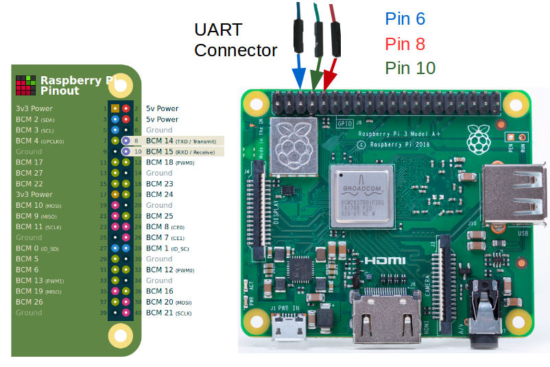

The
[Raspberry Pi](https://www.raspberrypi.org/help/what-%20is-a-raspberry-pi/) is a small computer that is ideal for learning computing and computer languages.
The AGL Project supports building images for the
[Raspberry Pi 5](https://www.raspberrypi.com/products/raspberry-pi-5/) board and
[Raspberry Pi 4](https://www.raspberrypi.org/products/raspberry-pi-4-model-b/) board.
These boards come in a variety of models.
See the
[Raspberry Pi Product Page](https://www.raspberrypi.org/products/) for more information.

This section describes the steps you need to take to build the
AGL demo image for the Raspberry Pi 4 board.

## 1. Making Sure Your Build Environment is Correct

The
"[Initializing Your Build Environment](../platform/initialize-build.md)"
section presented generic information for setting up your build environment
using the `aglsetup.sh` script.
If you are building the AGL demo image for a Raspberry Pi 5/4 board, you need to specify some
specific options when you run the script :

**Raspberry Pi5 :**

  ```sh
  $ source meta-agl/scripts/aglsetup.sh -f -m raspberrypi5 -b raspberrypi5 agl-demo agl-devel
  $ echo "# reuse download directories" >> $AGL_TOP/site.conf
  $ echo "DL_DIR = \"$HOME/downloads/\"" >> $AGL_TOP/site.conf
  $ echo "SSTATE_DIR = \"$AGL_TOP/sstate-cache/\"" >> $AGL_TOP/site.conf
  $ ln -sf $AGL_TOP/site.conf conf/
  ```

**Raspberry Pi4 :**

  ```sh
  $ source meta-agl/scripts/aglsetup.sh -f -m raspberrypi4 -b raspberrypi4 agl-demo agl-devel
  $ echo "# reuse download directories" >> $AGL_TOP/site.conf
  $ echo "DL_DIR = \"$HOME/downloads/\"" >> $AGL_TOP/site.conf
  $ echo "SSTATE_DIR = \"$AGL_TOP/sstate-cache/\"" >> $AGL_TOP/site.conf
  $ ln -sf $AGL_TOP/site.conf conf/
  ```

## 2. Configuring the Build to Include Packages Under a Commercial License

Before launching the build, it is good to be sure your build
configuration is set up correctly (`/build/conf/local.conf` file).
The "[Customizing Your Build](../platform/customize-build.md)"
section highlights some common configurations that are useful when
building any AGL image.

For the Raspberry Pi platforms, you need to take an additional
configuration step if you want to include any packages under a
commercial license.

For example, suppose you want to include an implementation of the
[OpenMAX](https://www.khronos.org/openmax/) Integration Library
(`libomxil`) under a commercial license as part of your AGL image.
If so, you must include the following two lines in your
`/build/conf/local.conf` file:

```sh
# For libomxil
LICENSE_FLAGS_WHITELIST = "commercial"
IMAGE_INSTALL_append = "libomxil"
```

## 3. Using BitBake

This section shows the `bitbake` command used to build the AGL image.

Start the build using the `bitbake` command.

**NOTE:** An initial build can take many hours depending on your
CPU and Internet connection speeds.
The build also takes approximately 100G-bytes of free disk space.

**Flutter Based IVI demo :**
The target is `agl-ivi-demo-flutter`.

```sh
$ time bitbake agl-ivi-demo-flutter
```

By default, the build process puts the resulting image in the Build Directory and further exporting that as `$IMAGE_NAME`.
Here is example for the Raspberry Pi 5 board for Flutter Based demo:

```sh
<build_dir>/tmp/deploy/images/raspberrypi5/agl-ivi-demo-flutter-raspberrypi5.rootfs.wic.zst

$ export IMAGE_NAME=agl-ivi-demo-flutter-raspberrypi5.rootfs.wic.zst
```

**Qt Based IVI demo :**
The target is `agl-ivi-demo-qt`.

```sh
$ time bitbake agl-ivi-demo-qt
```

By default, the build process puts the resulting image in the Build Directory and further exporting that as `$IMAGE_NAME`.
Here is example for the Raspberry Pi 4 board for Qt Based demo:

```sh
<build_dir>/tmp/deploy/images/raspberrypi4/agl-ivi-demo-qt-raspberrypi4.rootfs.wic.zst

$ export IMAGE_NAME=agl-ivi-demo-qt-raspberrypi4.rootfs.wic.zst
```

## 4. Deploying the AGL Demo Image

Deploying the AGL demo image consists of copying the image on a MicroSD card,
plugging the card into the Raspberry Pi board, and then booting the board.

Follow these steps to copy the image to a MicroSD card and boot
the image on the Raspberry Pi 5/4 board:

  1. Plug your MicroSD card into your Build Host (i.e. the system that has your build output).

  2. Extract the image into the SD card of Raspberry Pi 4 :

    **NOTE:** For Raspberry Pi 5, the image is at `<build-dir>/tmp/deploy/images/raspberrypi5/${IMAGE_NAME}`.

      Be sure you are root, provide the actual device name for *sdcard_device_name*, and the actual image name for *image_name*.

      ```sh
      $ lsblk
      $ sudo umount <sdcard_device_name>
      $ zstdcat -d ${IMAGE_NAME} | sudo dd of=<sdcard_device_name> bs=4M
      $ sync
      ```

    **IMPORTANT NOTE:** Before re-writing any device on your Build Host, you need to
        be sure you are actually writing to the removable MicroSD card and not some other
        device.
        Each computer is different and removable devices can change from time to time.
        Consequently, you should repeat the previous operation with the MicroSD card to
        confirm the device name every time you write to the card.

    To summarize this example so far, we have the following:
        The first SATA drive is `/dev/sda` and `/dev/sdc` corresponds to the MicroSD card, and is also marked as a removable device.You can see this in the output of the `lsblk` command where "1" appears in the "RM" column for that device.

  3. SSH into Raspberry Pi :
    - Connect Raspberry Pi to network : `Homescreen > Settings`, IP address mentioned here.
    - SSH :

      ```sh
      $ ssh root@<Raspberry-Pi-ip-address>
      ```

  4. Serial Debugging :

    When things go wrong, you can take steps to debug your Raspberry Pi.
    For debugging, you need a 3.3 Volt USB Serial cable to facilitate
    communication between your Raspberry Pi board and your build host.

    You can reference the following diagram for information on the following steps:

    

    1. Connect the TTL cable to the Universal Asynchronous Receiver-Transmitter
      (UART) connection on your Raspberry Pi board.
      Do not connect the USB side of the cable to your build host at this time.

          **CAUTION:** No warranty is provided using the following procedure.
          Pay particular attention to the colors of your cable as they could
          vary depending on the vendor.

    2. Connect the cable's BLUE wire to pin 6 (i.e. Ground) of the UART.

    3. Connect the cable's GREEN RX line to pin 8 (i.e. the TXD line) of
      the UART.

    4. Connect the cable's RED TX line to pin 10 (i.e. the RXD line) of
      the UART.

    5. Plug the USB connector of the cable into your build host's USB port.

    6. Use your favorite tool for serial communication between your build host
      and your Raspberry Pi.
      For example, if your build host is a native Linux machine (e.g. Ubuntu)
      you could use `screen` as follows from a terminal on the build host:

      ```sh
      $ sudo screen /dev/ttyUSB0 115200
      ```
