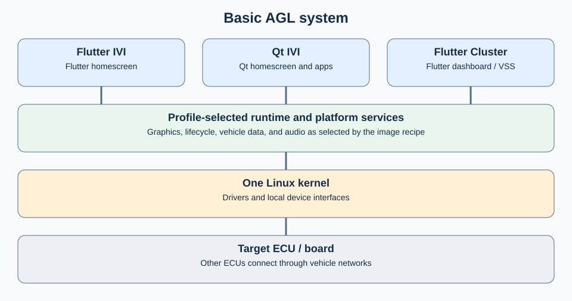
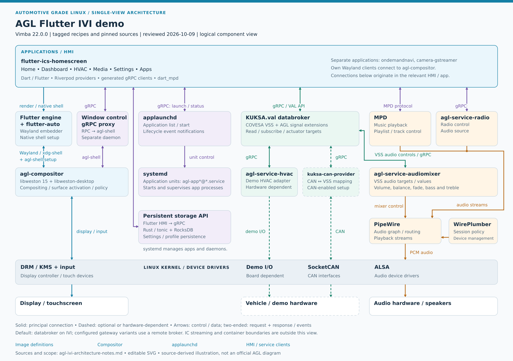
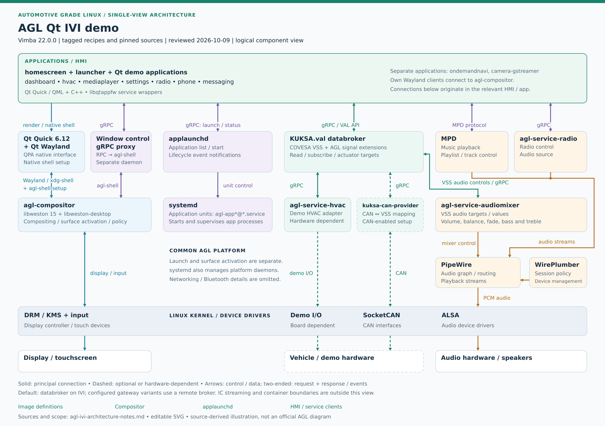

# Basic demo system

AGL provides an IVI platform with demo software and multiple GUI toolkits. Flutter is the current mainstream GUI toolkit, and Qt 6 is also supported. Basic demos use the AGL Linux distribution with the graphical runtime and applications selected by their image.

The Flutter-based Instrument Cluster is built on the IVI platform and demonstrates vehicle data using COVESA VSS. One kernel supplies the local system; communication with another ECU uses the configured vehicle-data and network interfaces.

| Demo | Application and runtime | Important boundaries |
| --- | --- | --- |
| Flutter IVI | Flutter homescreen and embedder | Infotainment applications use platform graphics, audio, lifecycle, and vehicle-data services. |
| Qt IVI | Qt homescreen and Qt applications | The Qt runtime changes the UI implementation; launcher and service integration still need the matching image. |
| IVI-based Flutter Cluster | Flutter dashboard on the compositor image family | The recipe selects cluster and VSS/KUKSA components; it does not install the entire IVI demo application set. |

## Common IVI platform

The Flutter IVI and Qt IVI demos use the same AGL IVI platform: the AGL compositor, application startup through applaunchd and systemd, vehicle-data interfaces, and audio/media services. For the AGL master baseline, the [Flutter image](https://git.automotivelinux.org/AGL/meta-agl-demo/tree/recipes-platform/images/agl-ivi-demo-flutter.bb?h=master) requires `agl-ivi-image-flutter.bb`, which extends the common `agl-ivi-image.bb`. The [Qt image](https://git.automotivelinux.org/AGL/meta-agl-demo/tree/recipes-platform/images/agl-ivi-demo-qt.bb?h=master) requires that common IVI base directly and adds the Qt demo package group. The [master source manifest](https://git.automotivelinux.org/AGL/AGL-repo/tree/default.xml?h=master) selects Yocto Wrynose and the meta-qt6 6.12 line.

### Flutter IVI demo

*Logical architecture diagram updated against AGL master recipes and their component SRCREVs on 2026-10-10. Open the figure for a full-size view; [source and scope notes](agl-ivi-architecture-notes.md) explain its version and deployment assumptions.*

The `flutter-ics-homescreen` application combines Home, dashboard, HVAC, media, settings and application-list pages. The Flutter engine and `flutter-auto` embedder provide its Wayland rendering path to `agl-compositor`. Native shell setup and gRPC window-control interfaces coordinate surface presentation. The homescreen requests external application discovery/startup from `applaunchd`; systemd starts and supervises application processes.

Vehicle subscriptions and actuator targets use the KUKSA.val databroker and COVESA VSS. Media control uses MPD, while radio and audio-mixer services provide separate backends. Playback streams pass through PipeWire; WirePlumber handles session/device policy. SocketCAN and board-specific adapters connect the platform to demo or vehicle I/O. See [Flutter IVI homescreen](../../components/applications/flutter-homescreen.md) for service clients and runtime configuration, and [Flutter IVI demo](../portfolio/basic/flutter-ivi.md) for the image and development route.

The master Flutter base also installs the [Persistent storage API](../../components/api/ivi/persistent-storage.md). The homescreen connects to it through gRPC for settings and profile data; its systemd unit requires that service alongside the compositor and applaunchd. The diagram shows this Flutter-specific path separately from vehicle signals and MPD playback.

### Qt IVI demo

*Logical architecture diagram with the same AGL master baseline as the Flutter diagram. The shared platform layers are retained while the UI and toolkit layer changes.*

The Qt image uses `homescreen`, a separate `launcher` and individual Qt applications. Qt Quick/QML and Qt Wayland supply the rendering stack. The homescreen binds the compositor's AGL shell extension for its background, panels and application-window region, and uses the shell proxy for activation and switching. The launcher uses `applaunchd` for the installed application list and startup requests; startup remains separate from displaying an application's surface.

Qt service wrappers, including `libqtappfw`, connect applications to the vehicle, media and other platform services. The common compositor, systemd, KUKSA.val/VSS and PipeWire/WirePlumber layers serve the same platform roles as in the Flutter image. Read [Qt IVI homescreen](../../components/applications/qt-homescreen.md), [Application startup and applaunchd](../../components/framework/lifecycle/application-startup.md), and [Qt IVI demo](../portfolio/basic/qt-ivi.md) for the concrete shell, launcher and build configuration.

## Platform services and image selection

The [AGL compositor](../../components/services/graphics/agl-compositor.md) manages graphical surfaces. Basic IVI audio uses [PipeWire and WirePlumber](../../components/services/sound/pipewire-wireplumber.md). Read [Application Framework](../../components/framework/lifecycle/application-framework.md) for lifecycle integration and [AGL Services](../../components/services/index.md) for the service catalog.

Master selects `kuksa-can-provider` and its AGL DBC/VSS configuration for CAN integration. The standard configuration uses `can0` and publishes through the databroker; the actual hardware and any bidirectional configuration depend on the selected variant. Audio and HVAC adapters remain separate services selected by the common IVI base. See the [master source and scope notes](agl-ivi-architecture-notes.md) for the inspected recipes and component revisions.

Software composition is controlled by the [image recipes](../build/common/reference/images.md) and [Yocto layers](../build/common/layers/overview.md). Do not infer that every Basic target includes every IVI service. Coordinated multi-board configurations can move vehicle-data responsibilities between IVI, cluster, and gateway systems.

Continue with the [Basic demo system](../portfolio/basic/index.md) or [Basic build](../build/basic/index.md).
