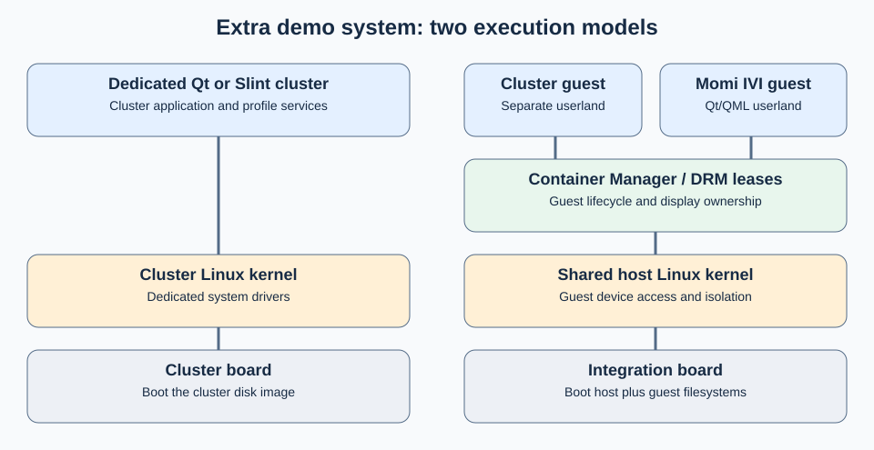

# Extra demo system

The Extra demo system includes an Instrument Cluster platform with demo software and a minimal-footprint IVI demo. The Qt-based Instrument Cluster starts from minimal userland as a foundation for a small-footprint system. The Slint-based Instrument Cluster is an early Rust-based example.

These demos have two different execution models: a dedicated cluster system or a Momi IVI container guest. Their display and data paths differ from the Basic IVI stack.

| Profile | Graphics and data path | Deployment unit |
| --- | --- | --- |
| Qt cluster | `cluster-refgui` uses EGLFS and `cluster-service` | Dedicated cluster disk image |
| Slint cluster | Rust/Slint application and cluster-profile packages | Dedicated cluster disk image |
| Momi IVI | Qt/QML homescreen and applications in a guest with leased display access | Container host plus registered guest filesystems |

The dedicated Qt and Slint images start from the boot image and select cluster packages. Their exact contents are defined by the [Qt image](https://git.automotivelinux.org/AGL/meta-agl-demo/tree/meta-agl-demo-shared/recipes-platform/images/agl-instrument-cluster-standalone-demo.bb) and [Slint image](https://git.automotivelinux.org/AGL/meta-agl-demo/tree/meta-agl-demo-shared/dynamic-layers/meta-slint/recipes-platform/images/agl-instrument-cluster-standalone-demo-slint.bb) recipes.

Momi shares the host kernel with the other container guests. [Container Manager](../../components/extensions/container-manager.md) controls guests and their resources; [DRM lease manager](../../components/services/graphics/drm-lease-manager.md) supplies display leases. Its own [Qt/multimedia package group](https://git.automotivelinux.org/AGL/meta-agl-demo/tree/meta-agl-demo-shared/recipes-platform/packagegroups/packagegroup-agl-momi-ivi-qt.bb) includes PulseAudio rather than assuming the Basic IVI audio configuration.

Use [Container integration architecture](../../small-integrated/containers/architecture.md) for the complete host topology. Continue with the [Extra demo system](../portfolio/extra/index.md) or [Extra build](../build/extra/index.md).
