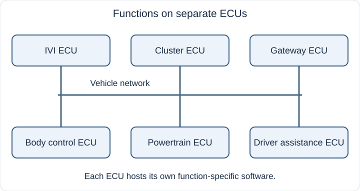
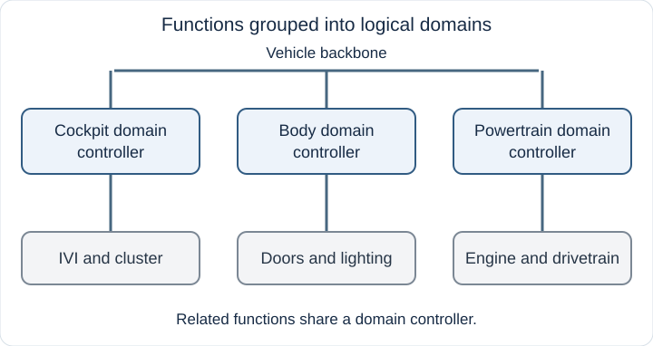
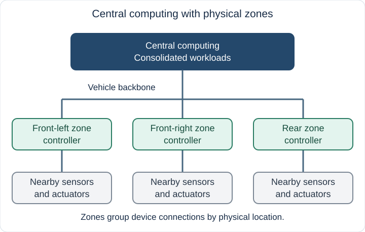
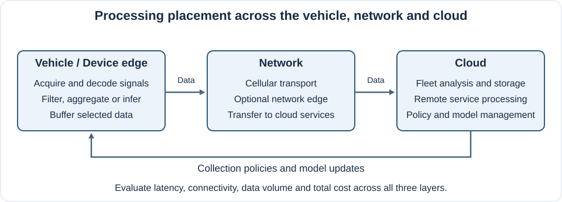

# Introduction

Software-Defined Vehicles (SDVs) build on several automotive technology trends: the consolidation of computing, changes to vehicle networks, shared software platforms, continuous software updates and connected data services. These developments shape both the hardware architecture and the way software is developed and maintained.

Within this transition, AGL focuses on two related areas introduced in this chapter:

- [Vehicle EE architectures](#vehicle-ee-architectures): where vehicle functions run, how controllers and devices connect, and how individual systems can be integrated on shared computing resources.
- [E2E Vehicle Data Processing](#e2e-vehicle-data-processing): how data processing is shared between the vehicle, communication networks and cloud services, with optimization across the complete end-to-end path.

## Vehicle EE architectures.

Vehicle electrical/electronic (E/E) architecture determines where software runs and how controllers communicate. Controller placement and network choices vary by vehicle. Select a figure to open a larger view.

### Traditional distributed architecture.

In a traditional distributed design, individual electronic control units (ECUs) handle specific functions and exchange data over vehicle networks. Adding features can add controllers and connections, increasing the work needed to coordinate software across the vehicle.

*Figure 1. Functions run on separate ECUs that communicate over the vehicle network.*

AGL's [Base platform for the distributed system](../standalone/index.md) mainly focuses on this architecture. Each standalone deployment supplies one Linux kernel and userland for its selected role, and several deployments can exchange vehicle data.

### Domain architecture.

A domain design groups related functions, such as cockpit, body control, or powertrain, under domain controllers. Computation is consolidated by functional responsibility, while communication between domains remains part of system integration.

*Figure 2. Functions are grouped into logical domains with their own controllers.*

AGL's [Base platform for the small-scale integrated system](../integrated/index.md) mainly focuses on this architecture. Container integration and KVM combine two or more features, such as IVI and Instrument Cluster, on shared computing resources.

### Central/Zone architecture.

A central/zone design combines central computing with controllers organized by physical location. Zone controllers connect nearby sensors and actuators to the vehicle network; central computers host consolidated workloads. This separates local device connections from software placement and can reduce wiring complexity. [NXP's architecture overview](https://www.nxp.com/company/about-nxp/smarter-world-blog/BL-HOW-ZONAL-EE-ARCHITECTURES) explains the shift from separate functions to domains and zones.

*Figure 3. Central computing hosts workloads while zones organize local device connections.*

AGL's [Base platform for the large-scale integrated system](../integrated/large-scale.md) mainly focuses on this architecture. SoDeV provides a platform for consolidating guest systems and workloads with different criticality requirements. Base platform for the distributed systems and small-scale integrations can be incorporated as part of that larger system.

## E2E Vehicle Data Processing.

For roughly the past 10-15 years, connected-vehicle services have collected vehicle data over cellular networks for processing in the cloud. The history extends to at least 2011: [Toyota's announcement of cloud-based telematics](https://global.toyota/en/detail/213386) describes a cloud platform for services delivered through wireless networks and data centers. In this model, vehicle signals are collected onboard and uploaded for functions such as fleet analysis, remote diagnostics and traffic services.

Device Edge computing moves some processing closer to the data source, into the vehicle. A vehicle can decode signals, select relevant events, aggregate measurements or run local inference before sending results to the cloud. For example, [AWS IoT FleetWise's Edge Agent](https://docs.aws.amazon.com/iot-fleetwise/latest/developerguide/how-iotfleetwise-works.html) applies collection schemes in the vehicle to decide which data to collect and when to transmit it. This illustrates how vehicle-side selection and cloud-side coordination can work together.

*Figure 4. A conceptual vehicle-to-cloud processing path. The network edge is optional; the figure describes processing placement rather than a specific AGL deployment.*

The device edge runs on vehicle hardware. A network edge runs in infrastructure outside the vehicle, such as an operator's network, and can provide nearby processing before data reaches a remote cloud. The [Automotive Edge Computing Consortium](https://aecc.org/about/) considers vehicle systems, telecommunications networks and cloud infrastructure together when addressing bandwidth, computing and storage efficiency.

An E2E (End-to-End) design evaluates the complete path from signal acquisition to the use of the result. Moving processing into the vehicle can reduce uploaded data and support local operation, while consuming onboard computing, energy and storage. Cloud processing can combine data from many vehicles, while depending on connectivity and remote resources. Choose the processing split against the requirements of the service:

| Design concern | Vehicle side | Network and cloud sides |
| --- | --- | --- |
| Response time | Measure acquisition, decoding, local processing and queueing. | Include uplink, any network-edge processing, cloud processing and the return path when needed. |
| Data volume and cost | Compare raw streams with selected events, summaries or inference results. | Measure cellular traffic, ingestion, storage and analysis costs across the fleet. |
| Connectivity | Define local behavior, buffering limits and data expiry during an outage. | Define retry, deduplication and backlog handling when connections return. |
| Data quality and protection | Preserve timestamps, signal meaning and the required detail; apply access and upload policies. | Keep schemas compatible and control retention and access to fleet data. |
| Resource management | Budget CPU/GPU, memory, storage and energy alongside other vehicle workloads. | Manage collection policies, software/model versions and fleet processing capacity. |

For example, a diagnostic service might evaluate a condition locally, retain a bounded interval of relevant signals and upload the event with its context. Assess the resulting diagnostic quality, onboard load, upload volume and cloud cost together. A smaller upload alone does not establish a better E2E design.

These processing choices apply across AGL's [Base platform for the distributed system](../standalone/index.md), [Base platform for the small-scale integrated system](../integrated/index.md) and [Base platform for the large-scale integrated system](../integrated/large-scale.md). Their E/E architecture determines where vehicle-side workloads can run; the network and cloud parts still require integration for the intended service.
