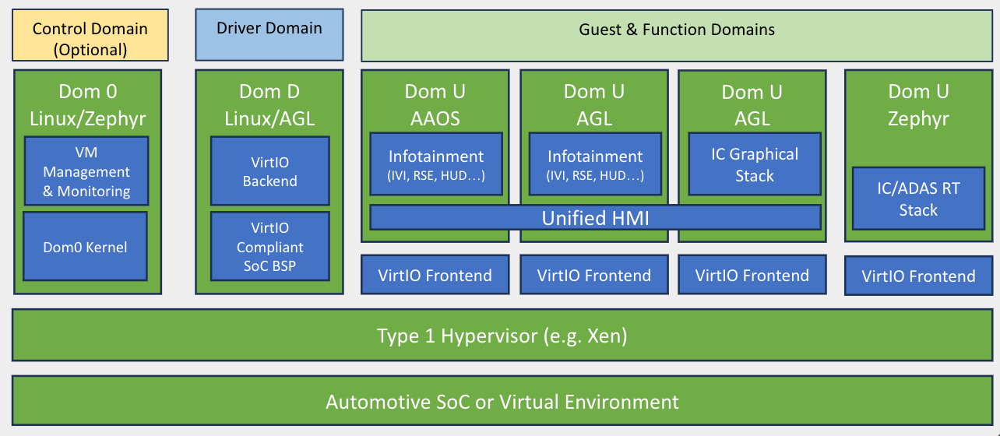

# Large scale integrated system

AGL's large-scale integrated system is based on SoDeV. It mainly addresses central/zone consolidation and supports combining guest systems and workloads with different criticality requirements. Start with the reference platform overview below, then follow the [SoDeV development chapter](sodev/index.md).

SoDeV is AGL's open source reference platform for software-defined vehicles. It combines the AGL Unified Code Base with Linux containers, VirtIO, the Xen hypervisor, Zephyr RTOS, and other platform components. This integration supports ECU consolidation and separates software development from hardware availability. The [official availability announcement](https://www.automotivelinux.org/announcements/automotive-grade-linux-releases-open-source-sodev-reference-platform-for-software-defined-vehicles-and-welcomes-five-new-members/) is the source for this overview.

The initial version became available on 14 May 2026 through the Ultimate Unagi release. The announcement describes Sparrow Hawk reference hardware, virtual machines, and cloud-based environments. Select the workspace and revision appropriate to your target before building.

## Official architecture

*Official AGL SoDeV architecture, reproduced unchanged from the [December 2025 launch announcement](https://www.automotivelinux.org/announcements/sodev/), which is linked from the availability announcement. [Original image](https://www.automotivelinux.org/wp-content/uploads/sites/61/2025/12/image.png). Select the figure for a larger view.*

The diagram separates platform management, device backends, and functional guests. It shows multiple guest platforms and their virtual device interfaces above the hypervisor, with Unified HMI serving the graphical guests.

Continue with [SoDeV development](sodev/index.md), [Build SoDeV](sodev/build.md), and [Create and Run Guest VM](sodev/customize/guest-vm.md). Target-specific workspaces define the concrete guest configuration.
