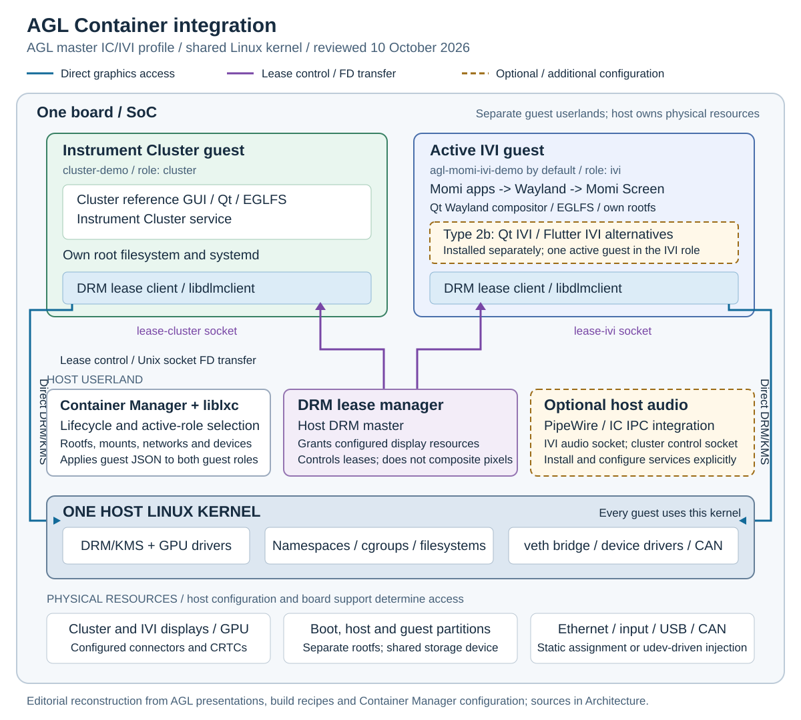

# Architecture

AGL Container integration provides a lightweight integrated system on Linux. Its Instrument Cluster (IC) / In-Vehicle Infotainment (IVI) reference profile combines separate guest userlands on one board using LXC and a shared host kernel. This page reconstructs the current reference architecture from AGL presentations, documentation, build recipes and guest configuration, reviewed on **8 October 2026**.

## Reference architecture

[Open the full-size architecture diagram](../../assets/diagrams/container-integration.svg).

*Figure 1. Original documentation diagram of the type 2a runtime, with type 2b IVI alternatives and optional audio integration identified separately. It is an editorial reconstruction, not a reproduced official slide. The source revisions are recorded below.*

The host runs Container Manager with `liblxc` to start and supervise guests. Each guest has its own root filesystem, applications and systemd instance. All guests use the host kernel and its drivers. The IC Expert Group's 2025 presentation describes this separation as **QM isolation**, using separate software stacks, namespaces and resource control. Its diagram also shows a separate lower isolation layer for safety functions; that layer is outside the container reference profile shown here. [2025 IC Expert Group presentation, slides 9-12][storage-talk]

### Integration types and active guests

| Profile | Composition | Image target |
| --- | --- | --- |
| Type 1 | Minimal LXC host; guest demo composition is supplied by the integrator | `lxc-host-image-minimal` |
| Type 2a | Host plus a Qt Instrument Cluster guest and Momi IVI guest | `agl-instrument-cluster-container-demo` |
| Type 2b | Type 2a plus separately built Qt IVI and Flutter IVI guest images, installed as IVI alternatives | `agl-instrument-cluster-container-demo` with `OUT_OF_TREE_CONTAINER_IMAGE_DEPLOY_DIR` |

In the demonstrated type 2b configuration, the cluster guest runs alongside **one active IVI guest**. Momi, Qt IVI and Flutter IVI occupy the same `ivi` role. Selecting a new active guest and shutting down the current IVI guest lets Container Manager cycle that role; installing several images does not make them all run concurrently. The official guide's guest-list example shows the cluster and Momi started, with Qt and Flutter disabled. [Build and boot profile, integration types and section 7a][profile]

The current demo recipe builds `guest-image-cluster-demo` and `guest-image-ivi-demo` through the `agl-container-cluster` and `agl-container-ivi` multiconfigs. The Cluster guest includes `cluster-refgui` and the Instrument Cluster service packages. The Momi guest includes Momi Screen, navigation, player and weather applications. These are independent guest images, assembled with the host into a Wic image. [Host recipe][host-recipe], [Cluster recipe][cluster-recipe], [Momi recipe][momi-recipe]

### Host control and guest boundaries

| Component or boundary | Responsibility |
| --- | --- |
| Container Manager + liblxc | Guest lifecycle, boot order and active-role selection; applies configured rootfs mounts, capabilities, devices, networks and resource settings |
| Host kernel | Process and network namespaces, cgroups, filesystems and physical device drivers shared by the guests |
| Guest root filesystems | Independently built software stacks mounted from guest partitions in the reference demo |
| Guest configuration | Defines which host paths, sockets and devices are visible in each guest |
| Physical resources | Display engines, GPU, storage and I/O remain host resources, with access controlled by the integration configuration |

Container Manager reads `/etc/container-manager.json` and the guest definitions under `/opt/container/conf/`. Guest roots are mounted under `/opt/container/guests/<name>/rootfs`. The global configuration identifies the guest-config directory and the `lxcbr0` bridge; per-guest JSON specifies the role, rootfs, lifecycle, mounts, devices and networks. Its schema supports cgroup v1/v2 limits and process limits. The reviewed Raspberry Pi demo JSON does not specify CPU, memory or I/O limits, so resource budgets require explicit configuration. See [Container Manager](../../components/extensions/container-manager.md), its [global configuration](../../components/extensions/container-settings/global.md) and [guest configuration](../../components/extensions/container-settings/containers.md). [Pinned Container Manager schema][cm-schema], [Cluster guest JSON][cluster-json], [Momi guest JSON][momi-json]

### Display ownership and rendering

The host **DRM lease manager** owns DRM master and grants configured connectors and associated display resources to guest clients. A guest's `libdlmclient` obtains a leased DRM file descriptor through a Unix-domain socket. The guest then renders directly through the kernel DRM/KMS interface using that descriptor. The lease manager handles display ownership; it does not composite guest frames into one host scene. This control/data separation is shown in the [2022 AGL Tech Day presentation, slides 11-13][techday], and documented in the [DRM lease manager guide](../../components/services/graphics/drm-lease-manager.md).

The reviewed Raspberry Pi host configuration names `lease-ivi` for `HDMI-A-1` and `lease-cluster` for `HDMI-A-2`. Guest configuration bind-mounts the corresponding host socket into `/var/display/drm-lease-manager/lease`. Connector names and available display resources depend on the board; these Raspberry Pi names are an example, not a universal assignment. [Board lease configuration][lease-config], [Cluster guest JSON][cluster-json], [Momi guest JSON][momi-json]

The Qt Cluster uses an EGLFS GUI. Momi Screen is a Qt Wayland compositor whose own display backend uses EGLFS; Momi applications are Wayland clients inside the IVI guest. Thus the current diagram distinguishes the two guest graphics stacks rather than copying the older Tech Day illustration of two generic Wayland compositors. [Cluster launch service][cluster-service], [Momi Screen source][momiscreen-source]

### Audio, networking and device access

Audio integration is shown as optional. The reviewed Raspberry Pi JSON contains optional bind mounts for an IVI PipeWire socket, `/run/pipewire/pipewire-0`, and a Cluster IC IPC socket, `/run/pipewire/icipc-0`. The reviewed host image recipe does not explicitly install PipeWire or `pipewire-ic-ipc`. These configuration hooks therefore require the matching host services and guest clients to be installed and configured before they provide a working audio path. [Host recipe][host-recipe], [Cluster guest JSON][cluster-json], [Momi guest JSON][momi-json]

Guest Ethernet interfaces use veth connections to `lxcbr0` in the reference configuration. Container Manager also supports vxcan for CAN connections. A CAN-enabled Cluster JSON example supplies that configuration separately; CAN access is not implied by the standard Ethernet bridge. Device definitions can map static device nodes/directories or inject matching devices dynamically using udev events, as illustrated by the Momi input/USB configuration. [Container Manager schema][cm-schema], [CAN-enabled Cluster example][can-json], [Momi guest JSON][momi-json]

### Storage and image assembly

The normal type 2a Wic layout places the host and guest filesystems in separate partitions. Type 2b additionally stages the Qt and Flutter IVI ext4 images from a separate build and adds their guest configuration and partitions. The partition numbers and boot-loader regions depend on the machine's Wic layout; select the board-specific layout rather than copying another board's device paths. Separate partitions isolate software stacks, but still share the underlying storage device and its I/O contention. [Image assembly include][assembly], [2025 IC Expert Group presentation, slides 11-13][storage-talk]

The reviewed master profile stages ext4 guest filesystems through its multiconfig assembly include. Its default board image is the WIC storage path shown in Figure 1. Verify the selected board's boot loader and partition layout when changing storage; separate guest userlands continue to share the host kernel.

## Sources and revision scope

The diagram describes the AGL master IC/IVI container profile, reviewed on 10 October 2026. [SoDeV](../../large-integrated/sodev/architecture.md) has its own architecture and integration choices. A future AGL release or a downstream image may use a different composition.

| Primary source | Evidence used |
| --- | --- |
| [AGL Tech Day, April 2022][techday] | Slides 11-13: lease control and direct DRM rendering; historical architecture context |
| [A Case Study for the Storage Isolation to Avoid System Slowdown Propagating from Other Containers, 2025 Summer AMM][storage-talk] | Slides 9-13: shared-kernel software separation; historical storage-isolation research; the current diagram follows master ext4/WIC recipes |
| [AGL Update, ALS 2025][agl-update] | Slide 33: IC Expert Group and Rockchip container-demo status |
| [Official master build/boot guide][profile] | Integration types, guest alternatives and role-switching workflow |
| [meta-agl-devel master, reviewed revision 9ca6a00][layer] | Host/guest recipes, multiconfig assembly, board-specific guest JSON and DRM lease configuration |
| [Container Manager, revision 0f578e0][cm-schema] | Version pinned by the reviewed layer; lifecycle and configuration schema |
| [meta-agl-demo master, reviewed revision b442b90][cluster-service] | Cluster launch configuration and Momi Screen package sources |

Full reviewed revisions: `meta-agl-devel` `9ca6a00e4c6d9e9e055d4b26faf729c7c5332071`; `meta-agl-demo` `b442b90ae8be41d438b6b01f6e17afb8eeab1a78`; Container Manager `0f578e0d93be14c31b56c6944ff9e60217e6df17`. These references describe a source inspection, not a new hardware validation.

Continue with [Build Container integration](build.md), its [detailed profile guide](build-guide.md), and [Create and Run Guest Container](customize/guest-container.md).

[profile]: https://docs.automotivelinux.org/en/master/01_Getting_Started/03_Build_and_Boot_guide_Profile/01_Instrument_Cluster_%28IC-IVI_with_Container_isolation%29/
[techday]: https://static.sched.com/hosted_files/agltechday2022/3b/agl-techday-202204.pdf
[storage-talk]: https://lf-automotivelinux.atlassian.net/wiki/rest/api/content/527761419/child/attachment/att533856273/download
[agl-update]: https://static.sched.com/hosted_files/ossjapan2025/d0/AGL%20Update%20Miner%20ALS%202025.pdf
[layer]: https://git.automotivelinux.org/AGL/meta-agl-devel/tree/meta-agl-ic-container?h=master
[host-recipe]: https://git.automotivelinux.org/AGL/meta-agl-devel/tree/meta-agl-ic-container/recipes-platform/images/agl-instrument-cluster-container-demo.bb?h=master
[cluster-recipe]: https://git.automotivelinux.org/AGL/meta-agl-devel/tree/meta-agl-ic-container/recipes-platform/images/guest-image-cluster-demo.bb?h=master
[momi-recipe]: https://git.automotivelinux.org/AGL/meta-agl-devel/tree/meta-agl-ic-container/recipes-platform/images/guest-image-ivi-demo.bb?h=master
[assembly]: https://git.automotivelinux.org/AGL/meta-agl-devel/tree/meta-agl-ic-container/recipes-platform/images/agl-lxc-multi-partition-image.inc?h=master
[cluster-json]: https://git.automotivelinux.org/AGL/meta-agl-devel/tree/meta-agl-ic-container/recipes-container/container-manager-config/cm-config-cluster-demo/rpi/cluster-demo.json?h=master
[momi-json]: https://git.automotivelinux.org/AGL/meta-agl-devel/tree/meta-agl-ic-container/recipes-container/container-manager-config/cm-config-agl-momi-ivi-demo/rpi/agl-momi-ivi-demo.json?h=master
[can-json]: https://git.automotivelinux.org/AGL/meta-agl-devel/tree/meta-agl-ic-container/recipes-container/container-manager-config/cm-config-cluster-demo/rpi/cluster-demo-can.json?h=master
[lease-config]: https://git.automotivelinux.org/AGL/meta-agl-devel/tree/meta-agl-ic-container/recipes-graphics/drm-lease-manager/drm-lease-manager-init/rpi/drm-lease-manager.ini?h=master
[cm-schema]: https://github.com/AGLExport/container-manager/blob/0f578e0d93be14c31b56c6944ff9e60217e6df17/doc/container-configuration-files.md
[cluster-service]: https://git.automotivelinux.org/AGL/meta-agl-demo/tree/meta-agl-demo-shared/recipes-demo/cluster-refgui/cluster-refgui/cluster.service?h=master
[momiscreen-source]: https://git.automotivelinux.org/AGL/meta-agl-demo/tree/meta-agl-demo-shared/recipes-demo/momiscreen?h=master
