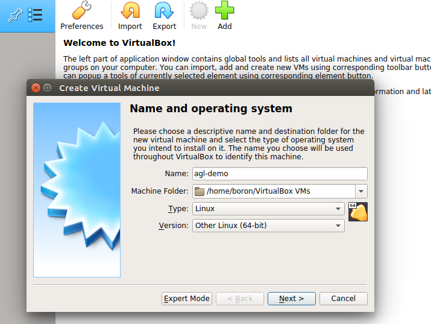
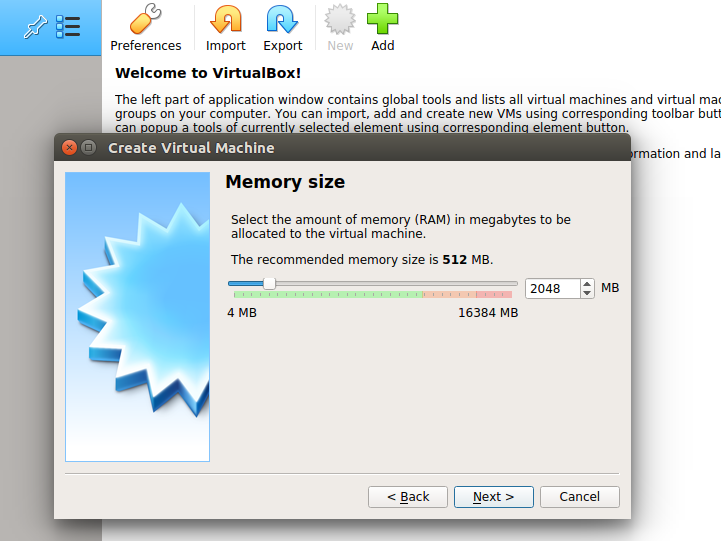
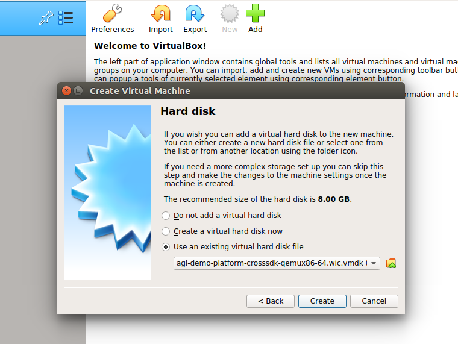
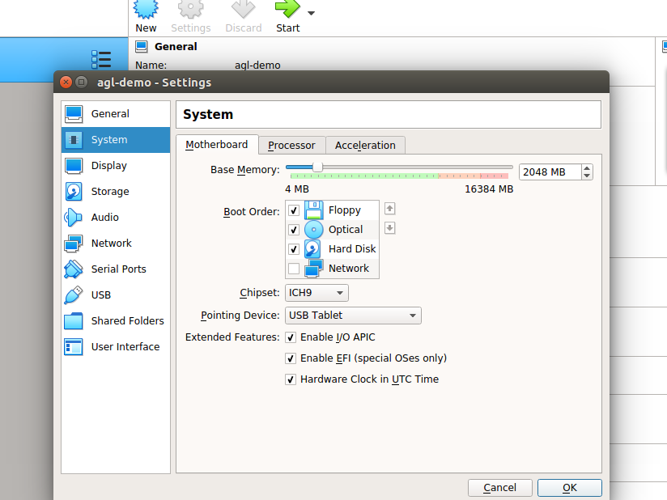
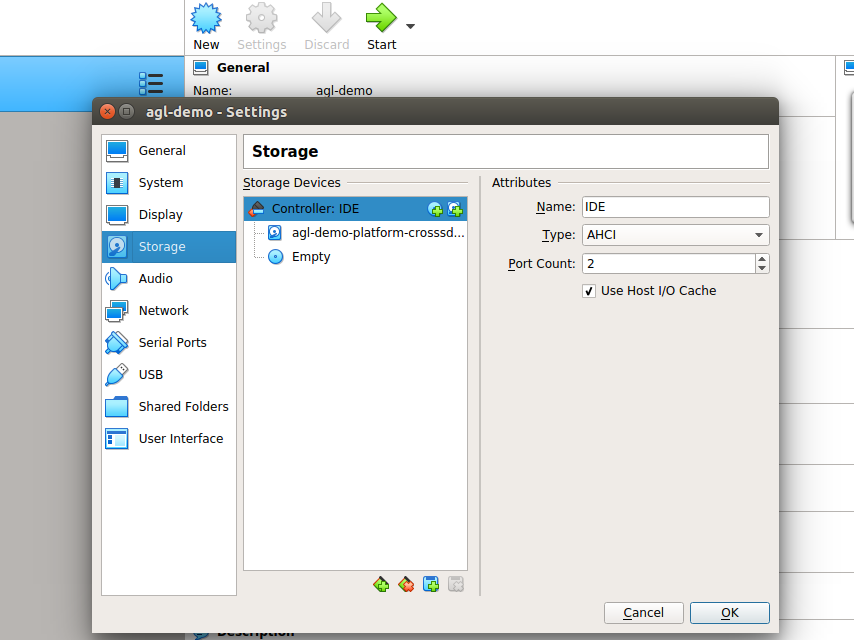

# Run AGL on VirtualBox

## Before you start

A host running VirtualBox; the demo requires a 1920 x 1080 display.

Use artifacts from the same AGL build. The configured channel is **{{ agl.codename }} / {{ artifact_kind }}**.

## Start AGL

**NOTE :** Please note [https://www.virtualbox.org/ticket/19873](https://www.virtualbox.org/ticket/19873) as this affects the VMs resolution.
The AGL demo images do require 1920x1080. The instructions below have been adapted.

  1. Download the [compressed vbox disk image]({{ agl_download_base }}/latest/qemux86-64/deploy/images/qemux86-64/agl-ivi-demo-qt-qemux86-64.wic.vmdk.xz).

  2. Install and set up [Virtual Box](https://www.virtualbox.org/wiki/Linux_Downloads).

  3. Extract the vmdk file : `$ xz -v -d agl-ivi-demo-qt-qemux86-64.wic.vmdk.xz`

  4. Configure virtual box for AGL :
    - Click on `New` or `Add`.
    - Enter Name as `agl-demo`.
    - Type as `Linux`.
    - Version as `Other Linux (64-bit)`, click on `Next`.
    
    - Select Memory size. Recommended is `2048 MB`, click on `Next`.
    
    - Click on `Use an existing virtual hard disk file`, and select the extracted `agl-ivi-demo-qt-qemux86-64.wic.vmdk` file, click on `Create`.
    
    - Go to `Settings`, and into `System`. Select `Chipset : IHC9`. Check on `Enable EFI (special OSes only)` and click on `OK`.
    
    - Go to `Storage`, and change the attribute to `Type : AHCI` and click on `OK`.
    
    - Next go to `Display` and change the attribute to 'VMSVGA' for the graphics driver. Change the graphics memory to be at least 64MB.
    - **Important:**: Open a new terminal window and execute this command:
    ```sh
    VBoxManage setextradata agl-demo VBoxInternal2/EfiGraphicsResolution 1920x1080
    ```
    - Return to the UI and click on `Start`.
    - For troubleshooting, you can refer [here](https://lists.automotivelinux.org/g/agl-dev-community/message/8474).

## Confirm the result

Confirm that the AGL console or demo UI starts. Check the image and kernel names if boot fails, and record the build identifier before reporting a problem.

## Next steps

- [Troubleshooting](../troubleshooting/index.md)
- [Develop an application](../develop/index.md#apps)
- [Choose another environment](prebuilt-images.md)
