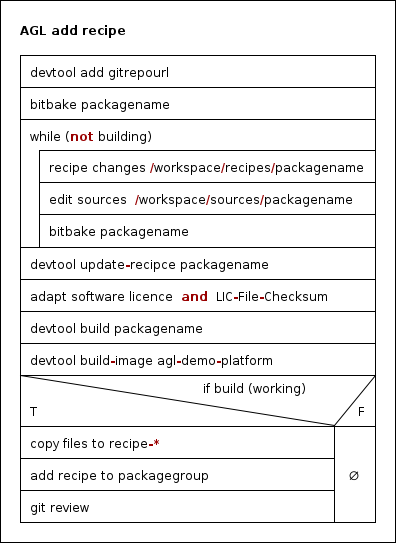

# Create a custom recipe

Use `devtool` from an initialized [AGL build environment](../../build/reference/common/initialize-build.md). This example adds an existing local source checkout as `my-service`; replace the recipe name and source path with those of your project. The source project must have a supported build system and a license file.

## Add and build the recipe

```sh
RECIPE=my-service
SOURCE_DIR="$HOME/src/my-service"
devtool add "$RECIPE" "$SOURCE_DIR"
devtool status
devtool edit-recipe "$RECIPE"
devtool build "$RECIPE"
```

Review the generated `LICENSE`, `LIC_FILES_CHKSUM`, build dependencies, runtime dependencies, and installation rules. `devtool add` creates a temporary workspace recipe; it does not establish correct licensing or runtime integration automatically. Use `devtool find-recipe "$RECIPE"` to locate the recipe rather than assuming an absolute `/workspace` path.

For an existing recipe, use `devtool modify "$RECIPE"` instead of `devtool add`. See the [official devtool reference](https://docs.yoctoproject.org/{{ yocto.codename }}/ref-manual/devtool-reference.html).

## Record source changes

After editing the source, build and test it. Commit the intended source changes before updating the recipe: `devtool update-recipe` ignores uncommitted source changes.

```sh
git -C "$SOURCE_DIR" diff --check
git -C "$SOURCE_DIR" add -u
git -C "$SOURCE_DIR" commit -s -m "Implement the service change"
devtool update-recipe "$RECIPE"
devtool build "$RECIPE"
```

Stage any intended new source files as well before committing. When using `devtool modify`, the source directory is the one reported by `devtool status`.

## Test an image and retain the recipe

To create a development image including workspace packages:

```sh
devtool build-image agl-ivi-demo-flutter
```

Select the image for your actual profile. Deploy it using the corresponding [board guide](../../build/reference/common.md), and check that the package and any required service work on the target.

Create a persistent custom layer from the initialized build shell, or use an existing layer:

```sh
bitbake-layers create-layer "$AGL_SOURCE/meta-custom-agl"
bitbake-layers add-layer "$AGL_SOURCE/meta-custom-agl"
devtool finish "$RECIPE" "$AGL_SOURCE/meta-custom-agl"
bitbake "$RECIPE"
```

`devtool finish` exports the recipe and committed patches to the layer and removes the workspace override. To retain the package in subsequent image builds, add it to your image recipe, a `.bbappend`, or an appropriate packagegroup. For a local evaluation, add this to `conf/local.conf`:

```conf
IMAGE_INSTALL:append = " my-service"
```

Then rebuild the selected image with `bitbake`. Check the layer into version control and follow [Contribution gide](../../../../../community/contributing/index.md) when submitting it upstream. For service registration, continue with [Create a service](../service/index.md).


