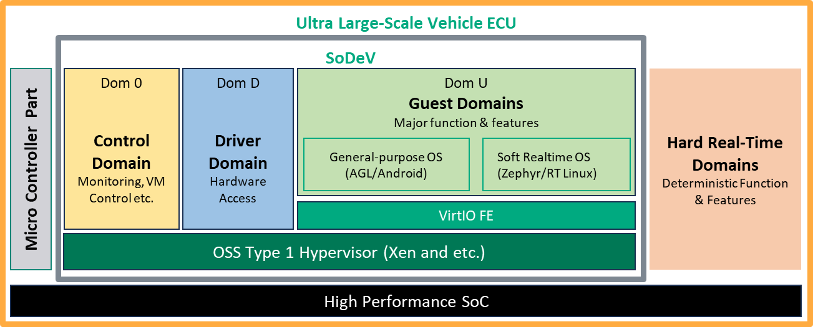
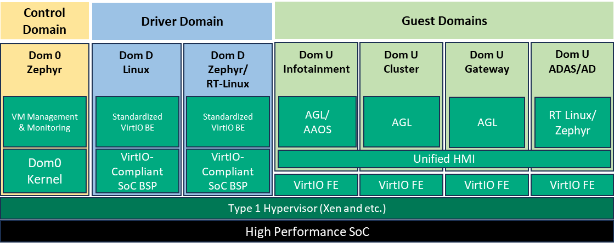

# Large-scale integrated system

AGL's large-scale integrated system is based on SoDeV. It mainly addresses central/zone consolidation and supports combining guest systems and workloads with different criticality requirements. Start with the reference platform overview below, then follow the [SoDeV development chapter](sodev/index.md).

SoDeV is AGL's open source reference platform for software-defined vehicles. It combines the AGL Unified Code Base with Linux containers, VirtIO, the Xen hypervisor, Zephyr RTOS, and other platform components. This integration supports ECU consolidation and separates software development from hardware availability. The [official availability announcement](https://www.automotivelinux.org/announcements/automotive-grade-linux-releases-open-source-sodev-reference-platform-for-software-defined-vehicles-and-welcomes-five-new-members/) is the source for this overview.

The availability announcement describes Sparrow Hawk reference hardware, virtual machines and cloud-based environments. This documentation uses master for AGL guest instructions; the selected board workspace supplies its own hypervisor and backend integration. See [Build SoDeV](sodev/build/index.md) for their relationship.

## Official architecture

{ .sodev-architecture }

{ .sodev-architecture }

*Official AGL SoDeV architecture overview and detailed design. Select either figure for a larger view.*

The overview places the control, driver and guest domains above a type 1 hypervisor on a high-performance SoC. It distinguishes general-purpose and soft real-time guest operating environments, and shows a microcontroller part and hard real-time domains alongside the SoDeV subsystem.

The detailed design shows VM management in Dom 0, hardware access and VirtIO backends in Dom D, and functional workloads in Dom U. Its examples include infotainment, cluster, gateway and ADAS/AD guests, with Unified HMI connecting their display integration. Read [SoDeV Architecture](sodev/architecture/index.md) for the domain and device responsibilities.

Continue with [SoDeV development](sodev/index.md), [Build SoDeV](sodev/build/index.md), and [Create and Run Guest VM](sodev/customize/guest-vm/index.md). Target-specific workspaces define the concrete guest configuration.
