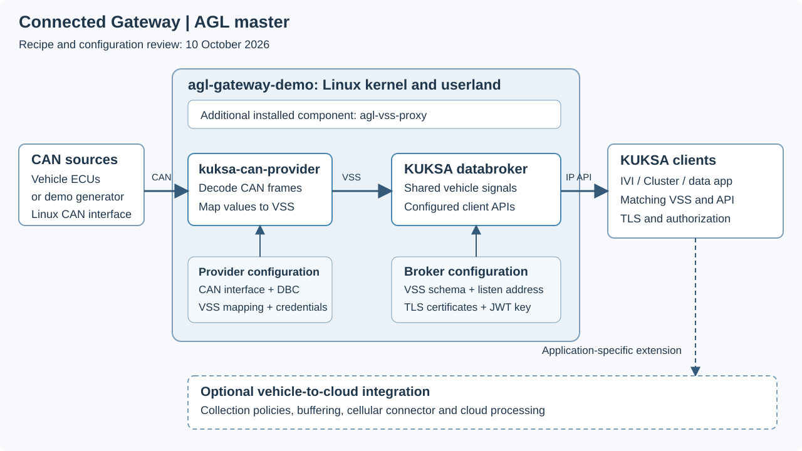

# Architecture

The Connected Gateway demo separates CAN acquisition from access to vehicle signals. It runs the CAN provider and KUKSA databroker on an AGL Linux system; IVI, Cluster and other clients use the configured data interface. The diagram follows the master image and package recipes reviewed on 10 October 2026.

*Figure 1. The master gateway demo's vehicle-side signal path. The dashed path represents application-specific vehicle-to-cloud integration. Select the diagram for a larger view.*

## Image composition

The [gateway image recipe](https://git.automotivelinux.org/AGL/meta-agl-demo/tree/recipes-platform/images/agl-gateway-demo.bb?h=master) extends `agl-image-minimal`, enables the `kuksa-val-databroker` image feature and OpenSSH, and installs `agl-vss-proxy` and `kuksa-databroker-env-open`. When `agl-devel` is selected, it additionally installs development utilities, including `kuksa-client`, `simple-can-simulator` and `tcpdump`.

The [databroker package group](https://git.automotivelinux.org/AGL/meta-agl-demo/tree/recipes-platform/packagegroups/packagegroup-agl-kuksa-val-databroker.bb?h=master) selects `kuksa-databroker`, its environment and certificates, `kuksa-can-provider`, the AGL provider configuration and `agl-vss-helper`. The diagram shows their main data and configuration dependencies. It lists `agl-vss-proxy` as an additional image component; that component is separate from the direct CAN-provider-to-broker path shown here.

## CAN-to-VSS data path

1. A vehicle ECU or demonstration generator supplies CAN frames to the configured Linux CAN interface.
2. `kuksa-can-provider` decodes frames using the DBC and maps the results to the configured VSS paths.
3. The provider publishes values to the local KUKSA databroker.
4. Configured IVI, Cluster or data applications access vehicle signals through the broker's client interface.

The [default provider configuration](https://git.automotivelinux.org/AGL/meta-agl-demo/tree/recipes-connectivity/kuksa-val/kuksa-can-provider-conf-agl/config.ini?h=master) selects `can0`, `/usr/share/dbc/agl-vcar.dbc` and `/usr/share/vss/vss.json`. Its broker endpoint is `localhost:55555`, with TLS enabled and a configured authorization token. These are reviewed defaults; image configuration and coordinated demo packages can select a different interface or mapping. Match the [AGL Virtual Car definition](../../virtual-car/index.md) with the files deployed on the gateway.

## Network and configuration boundaries

The gateway installs the open broker environment for remote client access. [Its master environment file](https://git.automotivelinux.org/AGL/meta-agl-demo/tree/recipes-connectivity/kuksa-val/kuksa-databroker-env/kuksa-databroker.open?h=master) sets `--address 0.0.0.0` while retaining the VSS file, TLS certificate/private key and JWT public key. Remote listening does not remove the configured TLS and authorization settings. Clients need the gateway's reachable address and matching credentials.

| Boundary | Configuration to align |
| --- | --- |
| CAN source to provider | Interface name, bitrate, DBC and signal encoding |
| Provider to broker | Endpoint, VSS mapping, TLS CA and authorization token |
| Broker to IVI/Cluster/data clients | Network address, selected API/protobuf revision, VSS paths and credentials |
| Gateway to external processing | Collection policy, buffering, transport, backend and data handling chosen by the integration |

Use [Gateway APIs](../../components/api/gateway.md) for interface references and [coordinated demo configuration](../../distributed/build/common/reference/images.md#coordinated-demo-configuration) for gateway/client placement. The master manifest and selected recipes govern component revisions; save the resolved manifest when assembling a gateway and its clients.

## Vehicle-side and cloud processing

Applications can select events or aggregate data in the vehicle before forwarding results. The gateway image recipe establishes signal infrastructure; it does not establish a complete cellular or cloud analytics deployment. Add the required connector, collection behavior and backend through the selected integration, then assess the complete [E2E processing path](../../home/index.md#vehicle-data-processing).

For host/guest consolidation, use the [Vehicle Controller platform comparison](../../vehicle-controller/index.md). For demonstration inputs, use [Demo Control Panel](../../components/tools/demo-control/panel.md) or [CARLA with AGL](../../components/tools/demo-control/carla.md). The source review describes image composition and configuration; it does not report a hardware or network runtime test.
